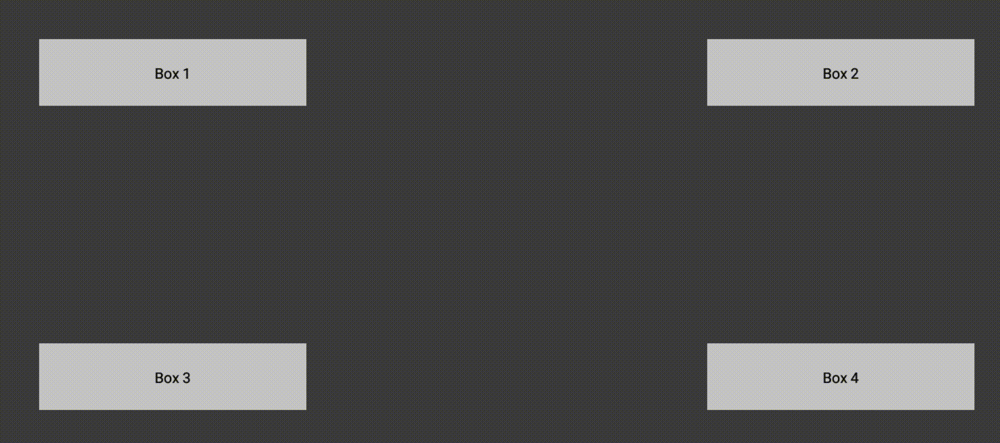

# Dpad Navigation with Refocus

Workaround example for Dpad navigation in [Jetpack Compose](https://developer.android.com/jetpack/compose) beta 02 with refocusing after the user has tapped the screen.

As of beta 02, Jetpack Compose doesn't fully support navigating focusable items using a dpad or arrow keys.
There is [a way that involves explicitly declaring the focus order](https://cs.android.com/androidx/platform/frameworks/support/+/androidx-main:compose/ui/ui/integration-tests/ui-demos/src/main/java/androidx/compose/ui/demos/focus/CustomFocusOrderDemo.kt),
but it assumes that an item is focused immediately when showing the content.
In practice, the desired behavior may be that focus isn't assigned until the user presses a key on the dpad.
Furthermore, whenever the user taps somewhere on the screen focus is lost and the user cannot regained focus by pressing the dpad keys.

This repo is an experimental workaround for addressing the aforementioned concerns given the current state of the APIs.
The beef is in [FocusableBoxes.kt](app/java/dev/berggren/FocusableBoxes.kt) and uses a full-screen composable to capture the focus whenever the user taps the screen with its focus order set to direct the user back to an item upon key presses.

Suggestions for alternative ways of solving this are welcome until we have official support for this feature. 🕺
